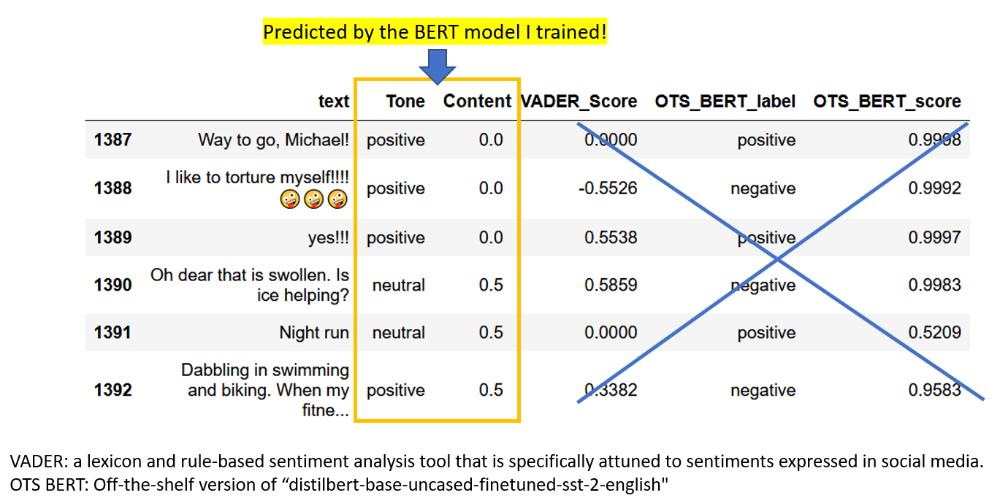

# Beyond Words - predicting user decision with text data

    

  

## Executive Summary
  * Software as a service (SaaS) is a major sector of cloud computing business. To thrive in this competitive market, growing user base is a crucial drive of business. Predicting and understanding customer decision are imperative to help a company timely adapt its service to meet users’ needs.  
  * Performing sentiment and text analysis on user communication data can be an effective approach to reflect user experience or satisfaction level. An algorithmic approach based on the user text data was carried out to predict when a user is about to subscribe or unsubscribe. The client of this consulting project is a startup company specializing in platforms designed for content creators to create their mobile apps. The data are generated from user communication in-app.  
  * 60 features were extracted from the text data marked with different time periods, including sentiment, number of characters, number of words, etc. Machine learning models such as Random Forest and XGBoost were trained by data with these features to predict user decision. Specifically, this model can 1) forecast users at high risk of churning 4 weeks in advance with 0.87 AUC and 2) esimate user lifecycle which was corroborated by additional time-series analysis. My client can have valuable time to take actions (e.g. sending out targeted surveys and in-app perks). And this model can evaluate the performance of these strategies. Therefore, this algorithmic approach can help my client to grown the premium users base through prediction and evaluation.

## Key Procedures
1. **Preprocessing text data for machine to read**
    - Converte emoji and emoticon by [*emoji*](https://github.com/carpedm20/emoji/) and [*emot*](https://github.com/NeelShah18/emot) packages, respectively.
    - Note: although [*emot*](https://github.com/NeelShah18/emot) can also process emoji, its emoji database is not as comprehensive as [*emoji*](https://github.com/carpedm20/emoji/).

2. **Choosing the right natural language processing (NLP)models**
    - Test unsupervised NLP: [TextBlob](https://textblob.readthedocs.io) and [VADER](https://www.nltk.org/_modules/nltk/sentiment/vader.html)
    - Test supervised NLP: off-the-shelf pretrained [BERT (state-of-the-art)](https://huggingface.co/transformers/main_classes/pipelines.html#transformers.pipeline)
    - Highly skewed data: user text contents were overwhelmingly positive and supportive, unsuitable for existing unsupervised models or off-the-shelf supervised models.
 
3. **Tuning BERT model with proper labelling**
    - Create two type of labels for each text: Tone (positive/neutral/negative) and Content (rich/partial/none)
    - Fine-tune two BERT models through [ktrain](https://arxiv.org/abs/2004.10703) for each label class separately
    - Achieved accuracy score 0.85 and 0.78 for Tone and Content, respectively
    - Note: another approach is to merge two label classes into one (2x3) to train one model (less costly but weakned prediction: accuracy score 0.67 due to data imbalance)
 
4. **Predicting user churn and bounce**
    - Only use text data generated before user decisions
    - Extract text features, including number of word, character, and text of differnt time periods for each user
    - Combine text features and sentiment features (60 features)
    - Applied classificiation models and a stacking ensemble (combined KNN, RF and XGB by Logistic Regression)
    - Achieved 0.89 and 0.76 accuracy for churn and bounce, respectively.

5. **Takeaways** 
   - Strong correlation between text and sentiment features
      - text meta features are good enough to predict user decision (easy to scale up for big data)
   - User engagement level is a key indicator of user decision
      - model can predict user churn 4 weeks before user decision
      - premium users have a lifetime 3-4 months 
   - With more data 
      - real-time prediction by creating feedback loop to constant update model  

## Presentation: [YouTube](https://youtu.be/dEOtCvfDBio) and [slides](https://er1czz.github.io/cv/Eric_Zhang_insight_demo.pdf)

## Examples
 

   
Click to show to an example of <b>Emoji and Emoticon Conversion</b>

 

 

   
Click to show the <b>Sanity Check</b> of sentiment analysis by different NLP models

<b>NLP Models Performance Comparision</b>, OTS: off-the-shelf 

 

## Last update 2020/11/05
## Created 2020/10/08
[**Current Page**](https://er1czz.github.io/beyondwords)    
[**Return to My GitHub**](https://github.com/er1czz)  

 
   >>>>>> <b>CC BY 4.0</b> <<<<<<    

