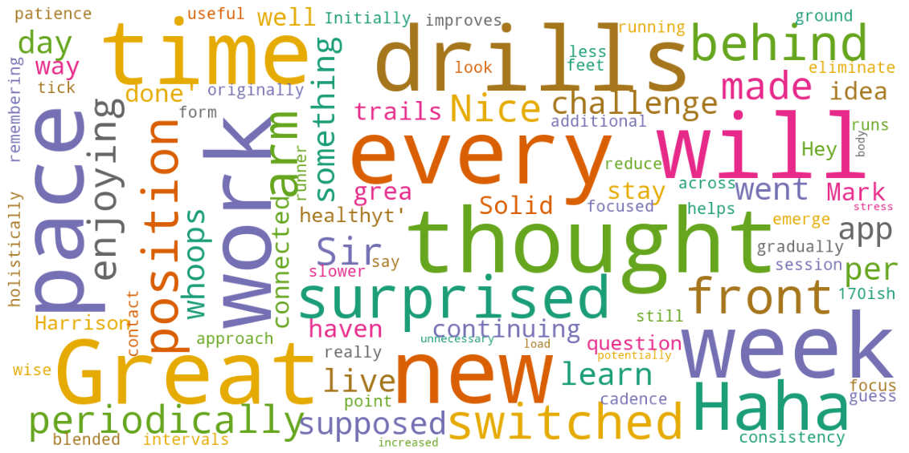
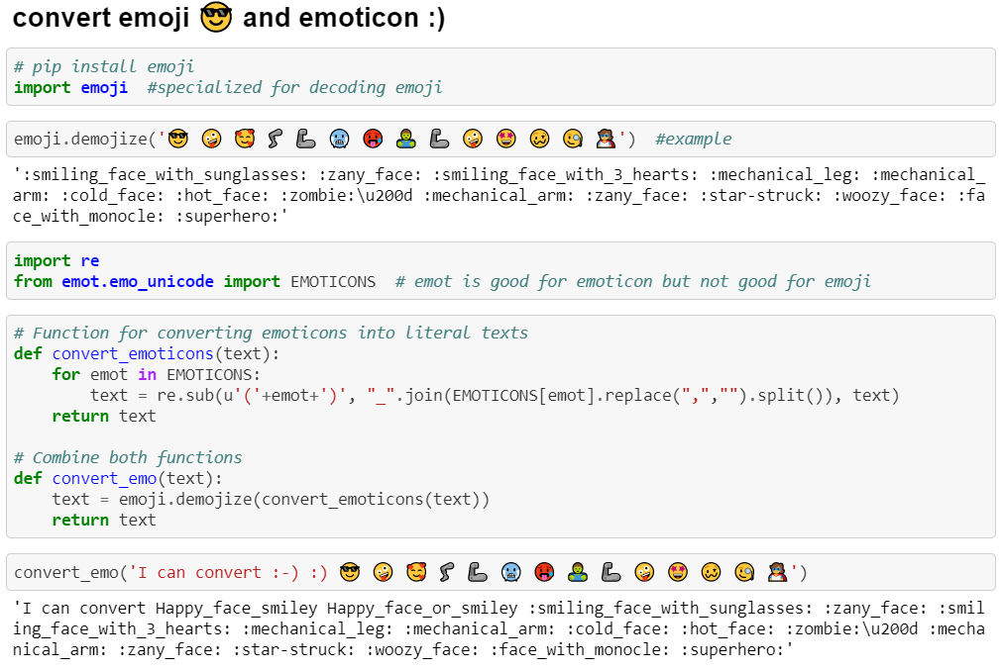
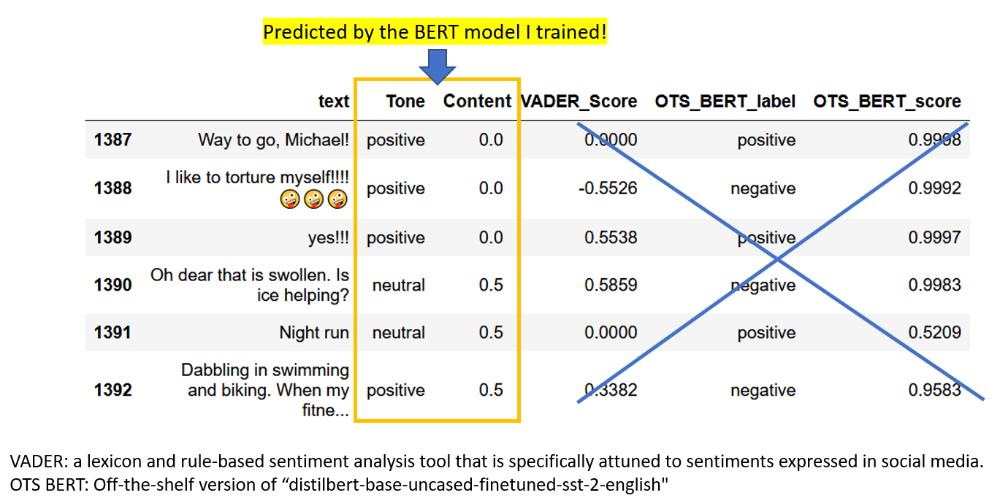

# Beyond Words - predicting user decision with text data</h1>

    

  

## Executive Summary
  * Software as a service (SaaS) is a major sector of cloud computing business. To thrive in this competitive market, growing user base is a crucial drive of business. Predicting and understanding customer decision are imperative to help a company timely adapt its product to meet users’ needs.  
  * Performing sentiment and text analysis on user communication data can be an effective approach to reflect user experience or satisfaction level. An algorithmic approach based on the sentiment and text analysis was carried out to predict when a user is about to subscribe or unsubscribe. The client of this consulting project is a startup company specializing in a fitness app designed for runners. The data are generated from user communication in-app.  
  * Several features were extracted from the text data by machine learning, including sentiment, number of characters, number of words, etc. A predictive algorithm was applied based on these features to predict user decision. Specifically, this model examined user conversion events within the free-trial period and predicted all the events. Therefore, this algorithmic approach can facilitate the development of effective marketing strategies for client to grow the premium user base by increasing the conversion rate. Similar approach can be used to improve user retention by predicting user unsubscription events (customer churn).

## Key Procedures
1. **Preprocessing text data for machine to read**
    - Converte emoji and emoticon by [*emoji*](https://github.com/carpedm20/emoji/) and [*emot*](https://github.com/NeelShah18/emot) packages, respectively.
    - Note: although [*emot*](https://github.com/NeelShah18/emot) can also process emoji, its emoji database is incomplete.

2. **Choosing the right natural language processing (NLP)models**
    - Test unsupervised NLP: [TextBlob](https://textblob.readthedocs.io) and [VADER](https://www.nltk.org/_modules/nltk/sentiment/vader.html)
    - Test supervised NLP: [Pretrained BERT (state-of-the-art and off-the-shelf)](https://huggingface.co/transformers/main_classes/pipelines.html#transformers.pipeline)
    - Highly skewed data: user text contents were overwhelmingly positive and supportive, unsuitable for existing unsupervised models or off-the-shelf supervised models.
 
3. **Tuning BERT model with proper labelling**
    - Create two types of labels for each text: Tone (netural/positive) and Fact (none/partial/rich)
    - Fine-tune BERT through [ktrain](https://arxiv.org/abs/2004.10703)
 
4. **Predicting user subscription within free-trial period**
    - Only use text data generated within the time period of free-trial
    - Extract sentiment features, number of likes, words, characters, as well as their average by comment number for each user
    - Apply a stacking classifier (Random Forest, XGBoost, and Ridge combined by Logistic Regression)
    - Predicted almost all conversion events (recall 0.99, precision 0.60)

5. **Takeaways** 
   - Top predictive features: characters, words, and their averages
   - User engagement level is a key indicator of conversion within the free-trial

## Examples
 

   
Click to show to an example of <b>Emoji and Emoticon Conversion</b>

 

 

   
Click to show the <b>Sanity Check</b> of sentiment analysis by different NLP models

<b>NLP Models Performance Comparision</b>, OTS: off-the-shelf 

   
####
**Updated 2020/10/11**   
[**Return to My GitHub**](https://github.com/er1czz)  
####

 
   >>>>>> <b>CC BY 4.0</b> <<<<<<    

